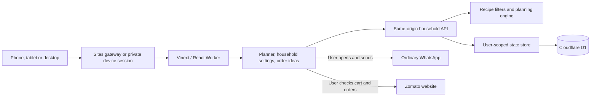
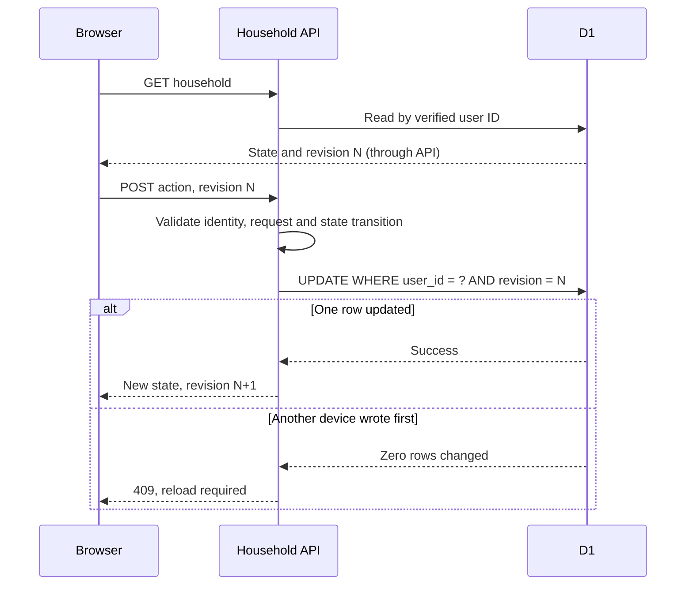

# Cook Bro architecture

## HLD: high-level design

Cook Bro is a stateful web application with deterministic meal planning. The primary user outcome is a confirmed next-day menu with usable quantities and a cook-ready message. A curated recipe catalogue provides predictable ingredients and preparation instructions; no runtime LLM, recipe-search service, advertising SDK or nutrition-estimation service is used.



### Responsibilities and boundaries

| Component | Responsibility |
| --- | --- |
| `app/page.tsx`, `app/chatgpt-auth.ts` | Require Sites gateway identity or a valid private-device session |
| `app/planner.tsx` | Date selection, meals, substitutions, shopping, confirmation and export |
| `app/household-form.tsx` | Inspectable preference editing with schema validation |
| `app/order-panel.tsx` | Ad hoc order-in selection, portion estimates, cost comparison and outbound links |
| `lib/device-auth.ts` | Issue and atomically claim device links; validate hashed D1 sessions |
| `lib/preferences.ts` | Shared preference schema, neutral defaults and time-zone date helper |
| `lib/food.ts` | Catalogue, filters, deterministic ranking, swaps, quantity scaling and message generation |
| `lib/orders.ts` | Static basket examples, rounded portion estimates and weekly counting |
| `app/api/household/route.ts` | Authentication, input validation, authorized state transitions and conflict responses |
| `db/store.ts` | Read/create one household per identity and compare-and-swap writes |
| `public/sw.js` | Generic offline fallback; no caching of private state |

Data is stored online and scoped to one authenticated account. Devices on that account share menus and preferences. Multiple family logins, household invitations and shared editing between different accounts are not implemented. Menu text can be shared externally without granting application access.

### Deployment topology

Vite and Vinext compile the React application to a Cloudflare Worker and static client assets. The bundled build plugin copies the hosting manifest and Drizzle migrations into `dist/.openai`. Sites packages these with `dist/server` and `dist/client`; production migrations are applied during deployment.

Standalone Cloudflare deployment uses `scripts/prepare-cloudflare.mjs` to set the Worker name, account, D1 binding and device-link authentication mode. Deployment identifiers are kept in ignored `cloudflare.local.json`; the owner email label and private defaults are Worker secrets. No Zero Trust organization or external login provider is used.

Local development uses Miniflare/D1 persistence and loopback-only mock authentication. Public forks have a neutral hosting manifest without a production project ID. Private instance defaults belong in a host secret, not source code or Git history. Publishing the code does not publish a deployment’s database or make a private site public.

## LLD: low-level design

### Data model

D1 table `households`:

| Column | Type | Meaning |
| --- | --- | --- |
| `user_id` | text primary key | Verified gateway subject, selected on the server |
| `state` | text | Serialized household JSON |
| `revision` | integer | Optimistic concurrency version |
| `updated_at` | text | ISO timestamp of the latest successful write |

```text
State
  revision
  settings
    phone1, phone2, allowMutton
    preferences: Preferences
  plans: { [YYYY-MM-DD]: Plan }
  pantry: { [YYYY-MM-DD]: ingredientKey[] }

Plan
  date
  breakfast[], lunch[], dinner[]   // recipe IDs
  confirmed, vegetarian
  preferences                    // settings snapshot for quantities
  sharedCurry
  takeout[]                      // meals not being cooked
  orders                         // optional basket ID by meal

Recipe
  id, name, kind, protein, cuisine, minutes
  ingredients[]: { name, qty, unit, category }
  steps[], note, allergens[]
```

The preference schema bounds household sizes, serving counts, repeat windows, arrays and strings. It validates diet/protein/staple enumerations, IANA time zones, sharing times and Indian PIN codes. Phone numbers use international format. The server independently validates all mutations; browser validation alone is not trusted.

### Menu generation

1. Load the current household preferences and requested date.
2. Select breakfast from allowed recipes. Vegetarian excludes eggs; eggetarian permits eggs but excludes meat and fish.
3. Resolve the day’s curry protein from the Sunday-first weekly array. A vegetarian-day override takes precedence. Enabled occasional mutton can replace a Sunday curry, subject to the 14-day exclusion.
4. Filter recipes by dish kind, cuisine, diet, declared/inferred common allergens, ingredient exclusions, selected protein, same-day use and nearby saved plans.
5. Exclude matching recipe IDs on other dates less than `repeatDays` away. The check works in either date direction because users can plan out of order. Rice, roti and paratha are exempt, but still checked against dietary ingredient restrictions.
6. Rank remaining recipes using recent-use penalties, a rotating cuisine preference and a stable date/recipe hash. The same inputs produce the same choice.
7. Add selected staple, optional dal, curry and optional vegetable side for lunch and dinner. Reuse the curry ID when shared cooking is selected.
8. Snapshot preferences into the plan and preserve existing order-in selections for that date. If no candidate fits, return a clear error; do not silently ignore restrictions.

A seven-day window is the default exclusion, while ranking considers up to 20 days. The catalogue may not support every combination at a 20-day minimum. “No repeat” means recipe ID, not ingredient or flavour. New-menu generation considers the current saved menu in ranking, while excluding it from the cross-date restriction.

Whole-dish alternatives use the same preference/nearby-date rules and preserve the curry’s protein. Swapping a shared curry replaces both references. Locked plans reject regeneration, swaps and order changes.

### Quantities and shopping

Catalogue quantities use a six-serving base. Each cooked recipe occurrence contributes ingredients to the day’s shopping list. A shared curry contributes twice if both lunch and dinner are cooked, and once when either meal is ordered in.

```text
ingredient quantity = base quantity × cooked occurrences × cooking servings / 6
                      × oilFactor (oil only) or saltFactor (salt only)
```

Ingredients aggregate by exact `name|unit`; incompatible units are not guessed or converted. Quantities round to two decimal places. Salt entries disappear from shopping when set to zero. Recipe views show a shared curry as one scaled batch, with explicit water-scaling and storage instructions. Pantry checks mean the household has enough of the aggregated ingredient for the whole day.

Confirmed plans retain their preference snapshot when settings change. Future drafts and their pantry checks are discarded so new generation uses the new preferences. User-selected exclusions match ingredient text; common allergen inference supplements catalogue tags. Neither process verifies external labels, cross-contact or substitutions.

### API contract

`GET /api/household` returns the authenticated household and revision. `POST /api/household` accepts one action plus the last-read revision:

| Action | Additional input | Effect |
| --- | --- | --- |
| `generate` | date, vegetarian | Generate an unlocked daily plan |
| `swap` | date, recipe ID, optional replacement ID | Replace a valid dish; update both shared references |
| `confirm` | date, confirmed | Lock or unlock a plan |
| `pantry` | date, ingredient key, checked | Update a validated shopping checkbox |
| `takeout` | date, meal, enabled | Toggle home cooking for the meal |
| `order` | date, meal, basket ID | Select an order idea and mark the meal as order-in |
| `preferences` | validated Preferences | Save preferences and refresh future drafts |
| `settings` | two optional phone numbers, allowMutton | Save sharing and occasional-mutton settings |

Dates are valid calendar days within 30 days of the current India date. Plans older than 30 days are pruned on mutation. Bodies are limited to 4,096 characters. The server rejects cross-site Fetch Metadata and mismatched Origin headers. Response data is `no-store`.

- `400`: malformed input, unsupported alternative or an unsatisfiable plan.
- `401`: no verified identity.
- `403`: cross-site or mismatched-origin mutation.
- `404`: action requires a menu that does not exist.
- `409`: locked menu or stale revision.
- `413`: oversized body.
- `503`: storage or unexpected processing failure.

### Concurrency



This prevents silent last-write-wins data loss. A browser-side busy guard also prevents overlapping local mutations. The planner refreshes on returning to a visible tab. Conflicts remain explicit rather than merging potentially incompatible meal decisions.

### Sharing and order integration

The message builder exports the selected menu, scaled ingredients still needed, optional full recipes, cooking notes and shared-batch storage instructions. It omits medical context and phone numbers. The user opens a URL-encoded WhatsApp message and sends it; long recipe messages use copy/paste. Preferred time is stored but no scheduler exists.

Zomato baskets are static, source-linked examples. Quantities are scaled to cooking servings and rounded up for restaurant portions. A location match enables the example restaurant links; other locations use generic search guidance. The budget calculator compares user-entered subtotal plus fees with the saved cap. There are no Zomato credentials, consumer login, order-history fetches, live prices, checkout calls or undocumented APIs.

### Security and privacy

In Sites mode, identity headers are trusted only behind the Sites gateway, which must prevent caller spoofing. In standalone mode, those headers are ignored. `lib/device-auth.ts` validates a random session cookie by comparing its SHA-256 hash against an unexpired D1 session. No authentication data is stored in localStorage, and missing configuration fails closed. No production local-auth bypass is provided. User IDs never come from the mutation body, and each database operation binds the verified subject.

Personal profiles and phone numbers live in user-scoped D1 JSON. No medication list is stored. Host-only initial preferences are optional secrets. Source exports omit private hosting identifiers, environment files, runtime databases and private Git history. The service worker does not cache authenticated pages/API data. A remote Wikimedia photo request discloses a normal browser request to Wikimedia; WhatsApp/Zomato are opened only by the user.

### Extension points and limits

- Add recipes with unique IDs, explicit units, allergens and tested preparation steps in `lib/food.ts`; extend planner tests for the new constraints.
- Add a food preference through the shared Zod schema, neutral default, household form, planner filter and tests together.
- Real Zomato integration needs a documented consumer API and approved OAuth scopes. Add server-side token storage, revocation, provenance and failure handling only once such access is available.
- Automatic WhatsApp delivery would need a provider, consent, a scheduler, approved templates where required, and delivery tracking. It is not approximated with browser timers.
- The current single JSON row suits a small household. Large multi-household collaboration, detailed history or analytics would need normalized plans/membership tables and separate authorization.
- PWA installation supplies a phone-friendly app shell; native iOS integrations, offline editing, push notifications and App Store distribution are out of scope for this implementation.

### Verification

Unit/domain tests exercise 180 generated days, rolling variety, configured chicken/fish schedules, vegetarian exclusion, shared swaps, batch scaling, order-in removal, custom staples, allergy inference, invalid preferences and date boundaries. Local API tests cover anonymous denial, origin rejection, invalid input, saved state, menu locks, immutable preference snapshots and stale writes. Device authentication tests exercise malformed tokens, hashed storage, two concurrent claims of one link, expiry, replay rejection, cookie flags and session revocation. TypeScript checks, production builds and desktop/mobile browser checks complete the release checks.


### Standalone device-link authentication

`device_links` stores `token_hash` (primary key), creation/expiry times and an optional redemption time. `device_sessions` stores a token hash, a short device label and creation/expiry times. Both tokens are independent 256-bit random values. Only hashes are persisted; raw session tokens exist only in HttpOnly cookies. All standalone sessions map to the same `household-owner` record. The configured owner email is a display label, not a verified identity claim.

`POST /api/auth/device` requires an exact same-origin Origin header and rejects cross-site requests. The `claim` action is the only unauthenticated mutation: it consumes an unexpired link with an atomic `UPDATE ... RETURNING`, creates a separate session and sets a Secure, HttpOnly, SameSite=Strict cookie. Replaying a link or racing another claimant fails. `issue` and `revoke` require a valid session. `logout` deletes the current session and expires its cookie. `GET` lists devices only to authenticated users. Device IDs returned to the owner are hashes, never reusable raw session credentials.

A ten-minute link carries its credential in the URL fragment. The sign-in page removes that fragment from history before a same-origin POST exchange. Private pages/API responses use `private, no-store` and `no-referrer`. When an already-connected browser arrives from an external link, the sign-in page checks its existing session with a same-origin request, which avoids asking it to pair again because of SameSite=Strict navigation behavior.

Initial admission and recovery are operator actions: an authenticated Wrangler session inserts a token hash and writes a private ignored link file. A short-lived loopback-only redirect can hand this link to the operator's browser without logging it. Subsequent devices connect using links issued from the Account screen. Links grant full household access, so they must be shared only with trusted devices. Sessions expire after 90 days and are revocable from another connected device. Public sign-up, automatic email delivery, account invitations with narrower roles and multi-household accounts are not implemented.
